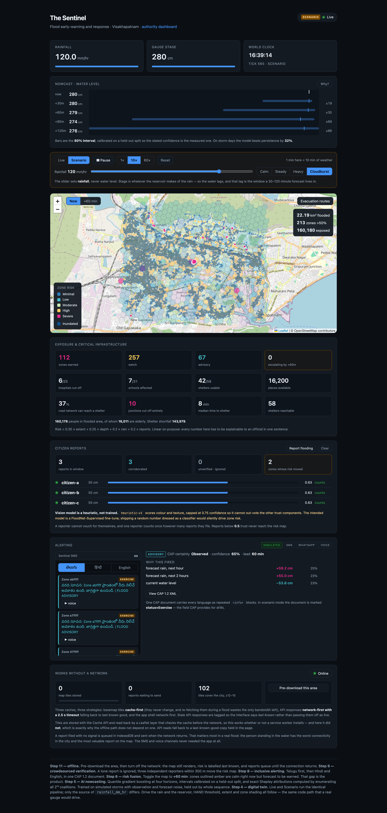
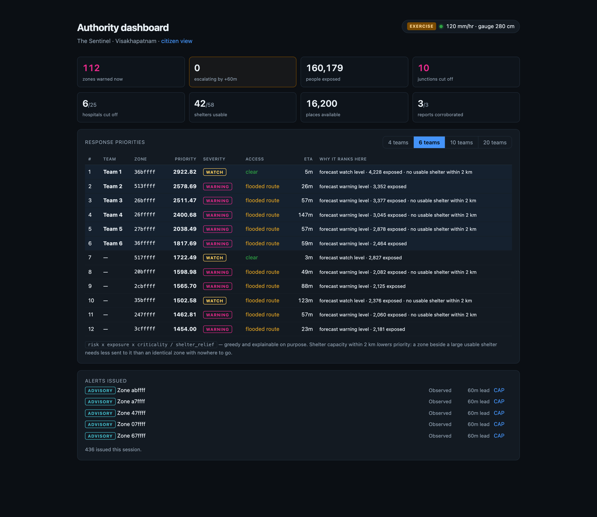

<h1 align="center">The Sentinel</h1>

<p align="center">
  <strong>Flood early-warning and response for Visakhapatnam</strong><br>
  Forecasts water levels 30–120 minutes ahead with calibrated uncertainty,
  routes evacuations around flooded roads,<br>and alerts in Telugu, Hindi and English —
  including with the network switched off.
</p>

<p align="center">
  
  
  
  
</p>

---

## What it does

Rain falls. A gauge rises. Between those two events there is a gap of an hour
or so — and that gap is the only window in which a warning can change what
anybody does. The Sentinel lives in that window.

| | |
|---|---|
| **Nowcast** | Water level at +30/60/90/120 min as a calibrated 80% interval, with exact Shapley attributions for every number |
| **Risk map** | 696 H3 zones scored on flood extent, depth, rainfall and citizen reports — shown *now* and *in 60 minutes* |
| **Routing** | Evacuation routes that avoid flooded roads, degrade to "risky" rather than failing, and report zones no road reaches |
| **Alerting** | CAP 1.2 documents carrying Telugu, Hindi and English in one message, with `status=Exercise` in drills |
| **Crowdsourcing** | Citizen reports scored for trust — a lone report is ignored, three independent ones move the map |
| **Dashboard** | Ranked response priorities, each row carrying the reason it ranks where it does |
| **Offline** | Cached tiles, last-known risk clearly labelled as stale, reports queued in IndexedDB until the network returns |

### Citizen view

Drag the rainfall slider and the reservoir, HAND threshold, inundation extent,
zone shading, routes and alerts all follow — the same code path a real gauge
drives.

<p align="center"></p>

### Authority dashboard

<p align="center"></p>

---

## Quickstart

```bash
git clone <your-repo-url> && cd the-sentinel
make setup      # venv + python deps
make prep       # DEM, HAND, road graph, zones, population
make train      # nowcast models (~2 min)
make api        # :8000
make web        # :3000
```

Then `make demo` for a clean starting state, and `make check` to verify all 18
endpoints before you present. Demo script: **[DEMO.md](DEMO.md)**.

No API keys are required — every data source has a keyless path.

---

## How honest is it?

Every claim below is measured, not asserted. The numbers come from a held-out
evaluation in `data/nowcast/report.json`.

- **Nowcast skill is 17% over persistence overall, ~30% on storm days.** The
  headline is dragged down by operator step changes, which no forecast can
  anticipate and real rainfall never does.
- **The 80% band covers 81%**, calibrated on a validation split and verified on
  test. It read 90% before calibration; a band that misstates its own
  confidence is worse than no band.
- **The vision model is a heuristic, not a trained network** (`"trained": false`
  in every response). A FloodNet fine-tune is the intended replacement.
- **Trained on synthetic storms** driven by the same reservoir the simulator
  uses, with observation and forecast noise, held out by whole sequence —
  because sub-hourly Indian gauge data is not public. The architecture
  transfers; the weights need local calibration.
- **Shelter capacity is an OSM per-type default**, not surveyed data.
- **Alert translations have not been reviewed** by a native speaker.

---

## Licence

Code is **MIT** (`LICENSE`). The data under `data/` is **not** — it derives
from OpenStreetMap (ODbL, share-alike) and GHS-POP (CC BY 4.0). See
**[DATA_LICENSES.md](DATA_LICENSES.md)** before publishing anything built from it.

> Map data © OpenStreetMap contributors, ODbL. Population: GHS-POP R2023A,
> European Commission JRC, CC BY 4.0. Elevation: AWS Terrain Tiles.

---

# Build log

What follows is the record of how this was built, step by step, including the
bugs. Kept deliberately: most of them are only visible once the thing runs.

## Run

```bash
make            # list every task
make setup      # once: create .venv, install python deps
make prep       # fetch data, build HAND / zones / road graph
make train      # train the nowcast models (~2 min, required for /nowcast)
make api        # :8000
make web        # :3000
```

No OpenTopography key yet? `make prep-synthetic` builds everything on stand-in
terrain so the whole stack runs; the map shows a banner until real terrain
replaces it. Then `make fresh-terrain && make prep`.

> **Do not run `./prep/setup.sh` directly.** macOS 15 tags files written by
> sandboxed processes with `com.apple.provenance`, so `exec()` on them fails
> with *Operation not permitted* even though the exec bit is set. `make` invokes
> `bash <file>`, which reads the script instead, and always works.

Docker (optional, for PostGIS):

```bash
docker compose up --build
```

| Service | URL |
|---|---|
| Web | http://localhost:3000 |
| API | http://localhost:8000 |
| Health | http://localhost:8000/health |
| Postgres | `localhost:5432` · `sentinel` / `sentinel` |

## Architecture in one paragraph

Everything reads from a single `WorldState` (`api/world.py`) fed by one of two
interchangeable adapters: **live** (Open-Meteo + sensors) or **scenario**
(replay file + rainfall slider). Nowcast, inundation, risk, routing and alerts
are all *pure functions* of that state — no DB reads, no HTTP, no clock access.
That is why the digital-twin demo behaves identically to live mode: same code
path, different adapter.

Full plan: `../flood-mvp-plan.md`

## Build progress

- [x] **1 — Spine.** WorldState contract, tick loop, SSE, schema, compose.
- [x] **2 — Geo prep.** DEM → HAND, road graph, H3 zones, population.
- [x] **3 — Inundation.** HAND threshold → polygon, live Leaflet map.
- [x] **4 — Sim console.** Rainfall slider, play/pause, 1×/10×/60×. *(F5 digital twin)*
- [x] **5 — Nowcast.** Quantile GBM + exact Shapley, calibrated bands. *(F1)*
- [x] **6 — Risk fusion.** Weighted zone risk, forecast view, infrastructure exposure.
- [x] **7 — Routing.** Flood-aware evacuation routing with degraded fallback. *(F2)*
- [x] **8 — Alerting.** CAP 1.2, Telugu/Hindi/English, simulated handset. *(F4)*
- [x] **9 — Crowdsourced verification.** Trust scoring, CV heuristic, risk fusion. *(F3)*
- [x] **10 — Authority dashboard.** Situation snapshot + ranked dispatch. *(F6)*
- [x] **11 — Offline.** Cached tiles, last-known risk, queued reports.
- [x] **12 — Demo polish.** `make demo`, `make check`, runbook, hazard registry.

## The contract

`WorldState` is frozen as of Step 1. Changing a field means coordinating every
track, so don't — extend downstream instead.

```python
t: datetime            # sim clock in scenario mode, wall clock in live
tick: int
rainfall_mm_hr: float
stages: Mapping[str, float]      # gauge_id -> cm
blocked_roads: frozenset[int]    # OSM way ids
reports: tuple[Report, ...]
mode: Literal["live", "scenario"]
```


## Step 2 — geo prep

One-off, idempotent, runs outside the API container:

```bash
cp .env.example .env          # add your OpenTopography key
export $(grep -v '^#' .env | xargs)
pip install -r prep/requirements.txt
python prep/run.py
```

Produces, in `data/`:

| File | Source | Feeds |
|---|---|---|
| `dem.tif` | AWS Terrain Tiles, or COP30 if reachable | HAND |
| `hand.tif` | pysheds `compute_hand()` | inundation, zone risk |
| `population.tif` | GHS-POP R2023A 3 arcsec, or WorldPop if reachable | affected population |
| `roads.graphml` | OSMnx drivable network + speeds | evacuation routing |
| `road_segments.geojson` | OSMnx edges | PostGIS blocked-road state |
| `facilities.geojson` | OSM hospitals / schools / shelters | critical infrastructure |
| `zones.geojson` | H3 res-9 + zonal min-HAND + population sum | the risk choropleth |

Every stage skips if its output already exists, so a failed run resumes where
it stopped. `--no-load` builds artifacts without touching PostGIS.

### Data caveats to state in the pitch

- **Terrain is real** (AWS Terrain Tiles) and **population is real** (GHS-POP).
  Shelter capacity is still an OSM per-type default, not surveyed data.
- **`elderly_frac` is a flat placeholder** (`prep/config.py`). WorldPop's
  age-structure rasters would replace it; until then, do not present
  per-zone elderly counts as real.
- **HAND assumes river/channel flooding.** It models water backing up from
  drainage lines, not pluvial ponding behind blocked storm drains — which is a
  large part of real Visakhapatnam urban flooding. Say so before a judge asks.
- **`ACC_THRESHOLD` is tuned by eye.** The run prints what fraction of the grid
  became channel; if the drainage network looks wrong for the terrain, change
  it and delete `hand.tif` to recompute.
- **OSM facility coverage is uneven.** Shelter capacity is a per-type default,
  not surveyed data.

## Step 3 — inundation

`GET /inundation?stage_m=` thresholds the cached HAND array and polygonises it.
31 levels (0–3 m at 10 cm) are pre-warmed at startup, so no slider position
ever pays the cold cost: served in **8–22 ms**, 4–5 ms on a cache hit.

| Endpoint | Returns |
|---|---|
| `/inundation?stage_m=` | flooded extent as GeoJSON |
| `/inundation?stage_m=&geometry=false` | area only, no polygonisation |
| `/inundation/current` | extent implied by the live gauge |
| `/zones` | the static H3 layer |
| `/zones/flooded?stage_m=` | per-zone flooded fraction + exposed population |
| `/facilities` | hospitals / schools / shelters |

Two design notes worth keeping:

- **Zones carry a HAND decile curve, not a minimum.** A res-9 hex spans ~117 DEM
  cells and almost every hex touches a drainage line, so a min-based rule floods
  60% of the city at 0.5 m. The decile curve is the zone's empirical CDF, so
  "what fraction of this zone is under water" is an interpolation — a graded
  choropleth, computed with no raster access.
- **The risk ramp is colour-blind-safe by construction** (`web/lib/palette.ts`),
  blue→yellow→magenta rather than green→red, monotonic in lightness so it also
  survives greyscale and projector washout. Water uses a separate colour so the
  two never read as one scale.

## Step 4 — the digital twin

Live and Scenario are the same pipeline. The only difference is where
`rainfall_mm_hr` comes from, and both drive the identical reservoir in
`api/adapters.py:advance_reservoir`. That is enforced in code, not asserted
in a slide — which is the answer when a judge asks whether the demo is real.

| Endpoint | Does |
|---|---|
| `GET /sim` | current mode, speed, rainfall, play state |
| `POST /sim/control` | `{mode, rain_mm_hr, speed, playing, reset}` |

**The slider sets rainfall, never water level.** Dragging stage directly would
skip the rainfall → runoff → stage chain that the nowcast model exists to
predict — i.e. it would fake the exact thing being judged. Setting
`rain_mm_hr` outside scenario mode returns **409**, and values are clamped to
0–150 mm/hr.

Speed lives on the tick loop, not the adapter: an adapter is asked to advance
`dt_s` of *world* time and has no idea how long that took in the room, so a 10×
demo and a 1× live feed exercise identical code.

Measured, cloudburst preset at 10×:

```
rain 0 -> 120 mm/hr instantly
gauge  40 -> 210 cm over ~180 world-seconds   (the lag is the point)
flooded  2.77 -> 14.27 km2
zones >50%  13 -> 154
rain -> 0 : gauge recedes smoothly, does not snap back
```

The ~170 s drainage time constant becomes ~17 s of real time at 10×: long
enough to watch rain lead water, short enough to hold a room. That gap is the
window a 30–120 minute forecast lives in.

## Step 5 — AI nowcasting

Water level at +30/60/90/120 min, with bands that mean what they say.

| Endpoint | Returns |
|---|---|
| `/nowcast` | four horizons, p10/p50/p90, current features |
| `/nowcast/explain?horizon_min=` | exact Shapley attribution |
| `/nowcast/skill` | the full held-out evaluation |

**Held-out test results** (split by whole sequence, never by row):

| Horizon | MAE | Persistence | Skill | Skill on storm days | 80% band coverage |
|---|---|---|---|---|---|
| +30 min | 6.58 | 8.12 | 19% | 32% | 90% → **82%** |
| +60 min | 11.58 | 13.88 | 17% | 29% | 90% → **82%** |
| +90 min | 15.63 | 18.26 | 14% | 29% | 89% → **82%** |
| +120 min | 18.59 | 21.91 | 15% | 31% | 87% → **81%** |

Read the two skill columns together. The headline number is dragged down by
`operator_steps` — instantaneous slider jumps, which no forecast can anticipate
and which real rainfall never does. On storm days, the case that matters, the
model beats persistence by about 30%.

### Five things done deliberately to keep it honest

1. **The model never sees truth.** Gauge readings carry ±2 cm noise, rain
   observations carry 15% multiplicative error, and rainfall *forecasts* carry
   error growing 20%→45% with lead time — the dominant real-world error source.
2. **Sequence-level holdout.** Splitting rows at random would leak badly:
   consecutive rows share overlapping feature windows.
3. **Persistence baseline.** Skill is reported against "assume no change",
   which is the first thing any hydrologist asks for.
4. **Calibrated intervals.** Raw quantile GBMs were under-confident — the
   nominal 80% band covered ~90%. A rescaling factor fitted on validation and
   verified on test brings it to 81%. A band that misstates its own confidence
   is worse than no band.
5. **Regimes the demo actually produces.** The first model forecast a collapse
   whenever rain was held steady (every training storm eventually ended) and
   once predicted a *negative* water level after a Calm→Cloudburst drag.
   Training now includes sustained rain and operator step changes, and served
   predictions are clamped at the channel bed.

### Explainability without the `shap` package

`shap` depends on numba, which has no wheel on every platform. With 10 features
we enumerate all 2¹⁰ coalitions directly against a 32-sample background, giving
**exact** Shapley values under the interventional expectation — the quantity
TreeSHAP approximates — in ~150 ms.

### A physics bug worth remembering

The reservoir used explicit Euler. At the 300 s training step the update
multiplier was `1 - K_OUT·dt = -0.8`: convergent but **oscillating**, so the
training data carried ringing artifacts, and at 60× the gauge leapt 130→240 cm
in six ticks. For piecewise-constant rain the ODE has a closed form, so
`advance_reservoir` now uses it and is exact at any `dt` — verified identical
across 1×300 s and 300×1 s. That is what makes "same code at 1× and 60×" true
rather than merely intended.

## Step 6 — risk fusion and exposure

| Endpoint | Returns |
|---|---|
| `/risk?horizon_min=` | per-zone risk now AND at the horizon, with severity |
| `/facilities/at-risk` | hospitals / schools / shelters, netted capacity |

```
risk = 0.35·extent + 0.25·depth + 0.20·rain + 0.20·reports
```

Linear on purpose. Every number on the dashboard has to be explainable to an
official in one sentence, and a judge has to follow it on a slide. The reports
term is 0 until Step 9 and the UI says so.

Severity bands are named for the **CAP vocabulary** (`advisory` / `watch` /
`warning`) so Step 8 can emit CAP alerts without a second mapping.

### The field that makes it a warning system

`zones_escalating` counts zones that are **calm now but forecast to be warned**.
Measured during a 8 → 140 mm/hr cloudburst at 5×:

```
stage 0.40 -> forecast 1.28 m   ESCALATING 64
stage 0.74 -> forecast 1.49 m   ESCALATING 42
stage 1.02 -> forecast 1.56 m   ESCALATING 30
stage 1.48 -> forecast 1.95 m   ESCALATING 20
stage 1.82 -> forecast 2.27 m   ESCALATING 11
```

The count decays as reality catches up with the forecast. Those zones are
outlined amber under the map's **+60 min** toggle. Anything a person can
already see out of the window is not a warning.

### Two runtime fixes this step forced

- **Warm start.** The model needed 13 five-minute buckets before answering —
  6.5 real minutes at 10×, which no demo or operator restart can afford. Reset
  now pre-fills a dry antecedent day, which is both the realistic pre-storm
  state and how training sequences begin.
- **Freshest observation.** Features read only *completed* buckets, so after a
  rain change the model was blind for up to 5 minutes of world time (60 real
  seconds at 5×) — exactly when a warning matters most. The in-progress bucket
  is now included.

### Honesty about population

`population_exposed` is returned as **null**, not 0, when the WorldPop layer is
absent, and the UI withholds the figure. A fabricated "people affected" number
is the easiest thing for a judge to disprove.

## Step 7 — dynamic evacuation routing

| Endpoint | Returns |
|---|---|
| `POST /route {lat, lon}` | route to the nearest usable shelter |
| `/routes/coverage` | how much of the city can still reach one |
| `/routes/priority` | routes out of at-risk hospitals and schools |

Roads are never removed from the graph. A **weight callable** evaluated per
query returns `None` for any edge whose lowest sampled point is under
`IMPASSABLE_DEPTH_M` (0.30 m) of water, so NetworkX skips it. Flood state
therefore costs nothing to apply — no graph rebuild, no topology recompute —
and a route can be recomputed on every slider frame.

One multi-source Dijkstra from every usable shelter over the **reversed** graph
answers "nearest shelter and the path to it" for all 4,934 junctions at once,
which makes per-citizen routing a dictionary lookup.

Measured as the city floods:

```
stage  reachable  median time to shelter  this citizen
0.00 m      4924                    113s     461s, 15 hops, 0 flooded crossings
0.80 m      3840                    143s    2467s, dashed (degraded)
1.94 m      3058                    182s    4970s, 43 hops, 4 flooded crossings
```

### Degraded routes rather than failure

If flooding severs every dry path, the router retries with flooded roads
penalised 25× instead of forbidden, and flags the result. The UI draws those
amber and dashed and names the number of flooded roads crossed. A hard block
that simply returns "no route" is worse than a route labelled risky: people
will move regardless, and they should move along the least-bad road.

Genuinely stranded junctions are reported, not hidden — that is the single most
important number on the screen when it is non-zero.

### Two bugs worth remembering

- **Path direction.** `multi_source_dijkstra` on a reversed graph returns paths
  running *shelter → origin*. Reading the last node as the destination silently
  produced unnamed shelters and backwards lines.
- **A metric that lied.** "Median time to shelter" was computed over
  dry-reachable nodes only, so as flooding worsened the distant nodes dropped
  out and the median *fell* — the dashboard claimed flooding improved
  evacuation times (113s → 100s → 88s). It is now taken over everyone who can
  still move: 113s → 143s → 182s.

## Step 8 — inclusive alerting

| Endpoint | Returns |
|---|---|
| `/alerts` | recent alerts, channel status, languages |
| `/alerts/outbox?lang=` | messages as a handset would receive them |
| `/alerts/{id}.xml` | the CAP 1.2 document |
| `POST /alerts/evaluate` | force a cycle (the loop runs one per 5 world-min) |

**Telugu leads.** Visakhapatnam is in Andhra Pradesh, so Telugu is the state
language and the default for voice; Hindi and English follow. One CAP document
carries all three as repeated `<info>` blocks, so a single alert object reaches
every speaker.

> **Translations are unreviewed.** They were written for a prototype and have
> not been checked by a native speaker. Alert wording decides whether people
> move; get them read by someone local before this sends to a real number.

The simulated channel is always on, so the demo cannot be broken by a carrier,
an expired sandbox or conference wifi. Twilio activates through the same code
path when `TWILIO_ACCOUNT_SID` / `TWILIO_AUTH_TOKEN` / `TWILIO_FROM` are set.

### Details that took more than one attempt

**`status=Exercise`.** In scenario mode every CAP document is marked Exercise —
the field the standard provides for drills. Emitting `Actual` from a simulation
would be indefensible.

**Debounce.** A zone must hold a severity for two consecutive cycles before it
fires. Without it, dragging the slider back and forth sends dozens of alerts.
Verified: pass 1 fires 0, pass 2 fires.

**CAP `<certainty>` is not confidence.** It was first derived from the
forecast's interval width, which produced
`<severity>Severe</severity><certainty>Unlikely</certainty>` during a
cloudburst — heavy rain widens the band. Certainty asks whether the event
happens, so it now comes from the quantiles: `p10 > now` → Likely,
`p50 > now` → Possible, and a zone already at threshold → **Observed**. The
band width is still shown to humans as "confidence", which is a different
question.

**Rate limiting, and who gets the budget.** A cloudburst pushes 200+ hexes over
threshold at once; one message per hex floods the channel and burns the Twilio
quota. `MAX_PER_CYCLE = 25`, and the held-back count is reported rather than
silently dropped. Sorting by severity alone spent the entire budget on zones
already underwater — where a warning is useless, because those people need
rescue, not notice. **Escalating zones now outrank already-flooded ones**, since
that is the only place an alert changes what someone does.

### Voice

The handset panel speaks each message with the browser's speech synthesis, so
the inclusion story demos with no credentials and no network. Production
renders Piper WAVs offline and plays them over a Twilio call — the reason Piper
is in the shortlist is that it keeps working during an internet outage.

## Step 9 — crowdsourced verification

| Endpoint | Does |
|---|---|
| `POST /reports` | multipart: lat, lon, depth_cm, reporter, optional photo |
| `GET /reports` | reports as GeoJSON with trust breakdowns |
| `POST /reports/reset` | clear the window |

```
trust = 0.40·cv_confidence + 0.30·reporter_history
      + 0.20·spatial_corroboration + 0.10·metadata_plausibility
```

Reports below **0.50** are shown as unverified and never reach zone risk.
Measured:

```
1 lone report                          trust 0.367   ignored
+ 2 independent reporters within 300 m trust 0.589   all three now count
+ 1 outlier 5 km away claiming 90 cm   trust 0.367   still ignored
zone risk with 3 corroborating reports 0.111 -> 0.287
```

That last line is the 0.20 reports weight engaging and pushing a zone across
the advisory threshold on citizen evidence alone.

### The vision model is honest about what it is

`cv.py` is a **colour/texture heuristic**, not a trained network, and every
response says so (`"trained": false`). It scores three properties real flood
water has in a ground-level photo — it sits low in the frame, it is desaturated
and brown/grey, and it is smoother than dry ground — and its confidence is
capped at 0.75 so it cannot out-vote the other trust components alone.

On synthetic test images: flooded street **0.703**, dry green street **0.025**,
noisy indoor shot **0.092**. Weak, but real, and replaceable by a
FloodNet-Supervised fine-tune without touching anything else. Shipping a random
number dressed as a classifier would silently drive zone risk, which is worse
than shipping nothing.

### Two bugs that only appear once you run it

**Corroboration deadlocked.** A report could only be vouched for by reports
that were *already trusted*, but every report starts untrusted — so nobody was
ever verified. Vouching now depends on the **reporter's standing**, which is
independent of the report being scored, breaking the circularity. A reporter
cannot vouch for themselves and counts once however many reports they file.

**A photo-less report was structurally capped.** Treating a missing photo as
`cv_confidence = 0` is not "no evidence", it is "evidence against", and it
capped such reports at 0.6 no matter how many neighbours confirmed them.
Weights are now renormalised over the components actually present.

### Feedback loop

After each alert cycle, reporters whose zone the model independently rates as
risky gain standing; those who did not, lose it — bounded to [0.05, 0.95] and
moved in small steps, so one report never makes or breaks a reporter and nobody
can farm influence. Visible in the demo: the first three reporters rose from
0.589 to 0.63 once the model agreed with them.

## Step 10 — authority dashboard

A separate view at **`/authority`** — a different user, not a different skin.

| Endpoint | Returns |
|---|---|
| `/situation` | everything an officer needs, in ONE call |
| `/dispatch?teams=&limit=` | ranked priorities with team assignments |

`/situation` exists so the dashboard polls once rather than five times. Five
separate calls can straddle a tick, and a population figure from one moment
beside a shelter figure from another is the kind of inconsistency that gets
noticed on stage.

```
priority = risk x exposure x criticality / shelter_relief
```

Shelter capacity within 2 km **lowers** priority: a zone beside a large usable
shelter needs less sent to it than an identical zone with nowhere to go. Every
row carries the reason it ranks where it does — an officer who cannot see why a
zone is third will not trust the list, and a solver nobody can interrogate at
3 a.m. is worse than an ordering everybody can argue with.

Each of the top zones is routed before a team is assigned, so a zone with no
road access is flagged **"NO ROAD ACCESS — boat or air"** rather than having a
road team dispatched to somewhere no road reaches.

### Three things the dashboard had to be honest about

- **Ties.** Without the population layer every exposure is 1, so priorities
  clump. Ties break on critical facilities, then least shelter nearby, then
  deterministically — and the UI says exactly that rather than implying the
  order is meaningful.
- **"Zones warned now" vs the table.** The KPI counts CURRENT severity while
  dispatch ranks FORECAST severity, so early in an event it reads 0 beside a
  table full of warnings. Both right; the label now says "now".
- **`EXERCISE` badge** sits in the header whenever the twin is driving, mirroring
  the CAP status on every document.

## Step 11 — works without a network

Verified by killing the API outright and reloading:

```
pill      "Offline — showing last known"
banner    "Last known — no connection to the service. Risk shown is the
           most recent good data, not live."
map       full Visakhapatnam basemap from cache
zones     658 polygons, risk-shaded
stats     16.89 km2 flooded, 230 zones >50%
reports   2 filed offline -> queued in IndexedDB -> auto-sent on reconnect
```

### It does not depend on a service worker

`public/sw.js` exists and handles caching where it installs, but **SW
registration was blocked in the environment this was built in** — the script
served 200 with the right MIME type and registration still failed. Since "the
map still renders with the network off" is the most convincing thing this
project does, it must not rest on a feature that can be switched off by an
embedded browser, a locked-down device or a policy. So the offline path is
implemented in the page and works either way:

| Layer | Mechanism | Needs SW? |
|---|---|---|
| Basemap tiles | Cache API + a Leaflet layer that checks the cache first | no |
| API reads | last-known-good snapshot in the page, flagged stale | no |
| Queued reports | IndexedDB, replayed on reconnect | no |
| App shell | service worker, when it installs | yes |

OSM tile servers send permissive CORS headers, so cached responses are
readable and can be turned into blob URLs. An opaque `no-cors` response can be
stored but never read back — the trap this avoids.

### Three bugs only an actual outage reveals

- **The report panel vanished offline.** It returned `null` until its first
  successful fetch, so with the backend down there was no button to file a
  report — at exactly the moment someone is standing in the water with the most
  valuable report on the map. It now renders a degraded state and files
  straight to the queue.
- **The map refresh was gated on the SSE stream**, which is the first thing to
  die. Opening the app *during* an outage showed a grey map. It now paints once
  from last-known-good as soon as the layers exist.
- **The queue never drained.** The browser `online` event fires when the
  *device* loses its network, not when a backend is unreachable — the far
  commoner case. Anything queued sat there forever. It now retries whenever
  something is pending and `/health` answers.

### Colour-blind safety was never a toggle

The risk ramp is blue→yellow→magenta rather than green→red, monotonic in
lightness, chosen that way in Step 3 rather than bolted on here — see
`web/lib/palette.ts`. Water uses a separate colour from the risk scale so the
two never read as one gradient.

## Step 12 — demo readiness

```bash
make check   # 18-endpoint smoke test, ~10 s
make demo    # reset to a known-good state
```

`make check` has already caught two things that would have shown on stage, most
recently a cold-start `nowcast: WARMING` — the forecast history was warm-started
only on reset, so the very first page load after starting the API showed a
half-broken panel. Run it before presenting, every time.

`make demo` clears alerts, clears reports, returns to calm scenario at 10× and
zeroes the world clock. One command: hunting for three reset buttons while a
room waits is its own kind of failure.

### Rehearsed, not assumed

The whole script was run against the live build and timed:

```
0:00  reset — calm, 40 cm gauge
0:45  Cloudburst — 140 mm/hr
1:30  73 zones ESCALATING, warned before the water arrives
2:15  alert: watch / CAP Likely / 60 min lead / status Exercise
      why: forecast rain next hour +55.4 cm (38%)
      handset (Telugu): వరద సూచన …
3:00  3 citizen reports -> 3 corroborated, 2 zones moved
      route 41 min, DEGRADED, crosses 1 flooded road
4:00  200 zones rated · 1/25 hospitals cut off · 22,200 places · 10 junctions isolated
      Team 1: prio 0.91 — forecast watch level; 1 hospital inside
4:45  wifi off — map renders, reports queue
5:15  1 hazard implemented, 3 declared
```

It also caught an ordering bug: every alert in a cycle shares a `sent`
timestamp, so sorting on it was unstable and the alert list could disagree with
the handset about which alert was newest. Alerts now carry a sequence number.

### `GET /hazards` — the scale-out claim, in code

`api/hazards.py` declares all four hazards with their forcing variable,
exposure surface, data sources, what they reuse and what would still need
building — and marks three of them `implemented: false`. Claiming four hazards
when one works is the kind of thing that unravels under a single question; a
config a judge can read is worth more than a bullet on a slide.

Cyclone is the cheapest next one: surge reuses the same HAND surface, so only
track ingestion and a wind-radius buffer are new.

### Real data, via fallback sources

Both primary providers were unreachable while this was built, so the pipeline
grew a fallback chain. `prep/run.py` tries the primary, then the fallback, and
the outputs are byte-compatible — nothing downstream knows which one ran.

| Layer | Primary | Fallback actually used | Why |
|---|---|---|---|
| DEM | OpenTopography COP30 | **AWS Terrain Tiles** (`elevation-tiles-prod`, terrarium z13) | `portal.opentopography.org` did not resolve |
| Population | WorldPop 100 m | **GHS-POP R2023A** (JRC, 3 arcsec tile R8_C27) | WorldPop served at 7 KB/s — ~20 h — and ignores Range headers |

Both fallbacks are free and keyless. AWS terrain tiles are Web Mercator PNGs
with `elevation = (R*256 + G + B/256) - 32768`, reprojected to the same
WGS84 1-arcsec grid COP30 would have produced. GHS-POP ships 10-degree tiles,
so the one covering Visakhapatnam is 20 MB rather than 506 MB.

**Attribution is required for both** — JRC GHSL for population, and the
Terrain Tiles sources (SRTM and national DEMs) for elevation.

Real terrain gives elevation 0–496 m across the AOI, which matches the hills
around Simhachalam, and **537,111 residents** in the 74 km² bbox.

### Verifying the hydrology

`prep/hydrology.py` is covered by an analytical test: a synthetic V-shaped
valley whose HAND is known in closed form.

```bash
python prep/tests/test_hydrology.py
```

Checks depression filling, D8 routing completeness, flow concentration, and
HAND values at 3/5/8 cells up the valley wall against `slope x distance`.
